# 🍪 Cooki - AI 레시피 커뮤니티 앱

<p align="center">  </p>

## 📌 프로젝트 소개

Cooki는 AI를 활용해 사용자가 원하는 레시피를 쉽고 빠르게 생성하고, 커뮤니티와 공유할 수 있는 요리 앱입니다. 재료나 음식 사진 하나만으로도 맞춤형 레시피를 생성할 수 있으며, 다른 사람의 레시피를 평가하고 저장할 수 있는 커뮤니티 기능을 제공합니다.

## 📱 주요 화면

<div style="background-color: #F1F2F1; padding: 20px; border-radius: 12px;">  
  <div style="display: flex; flex-wrap: wrap; gap: 20px; justify-content: flex-start;">  
    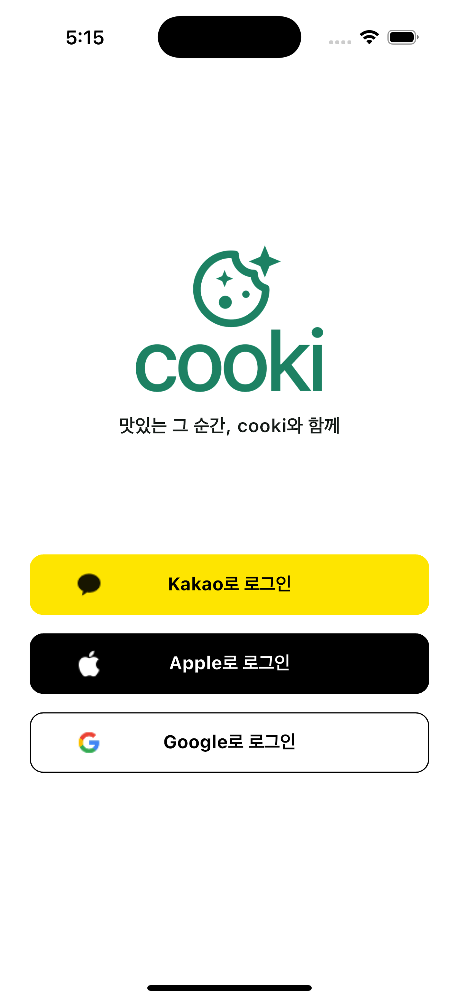  
    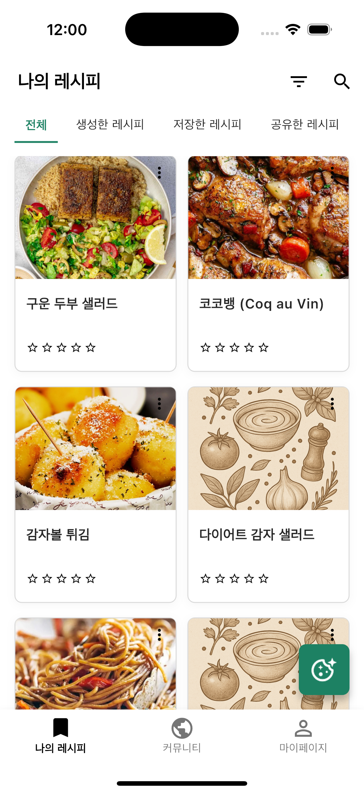  
    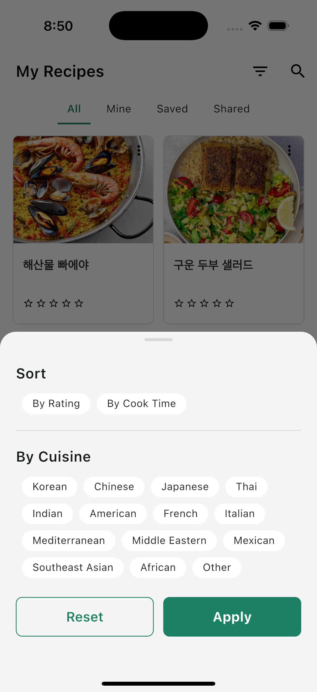  
    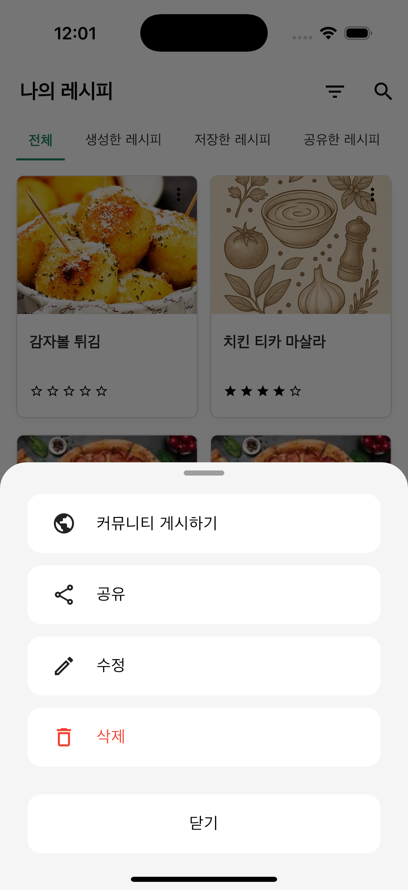  
    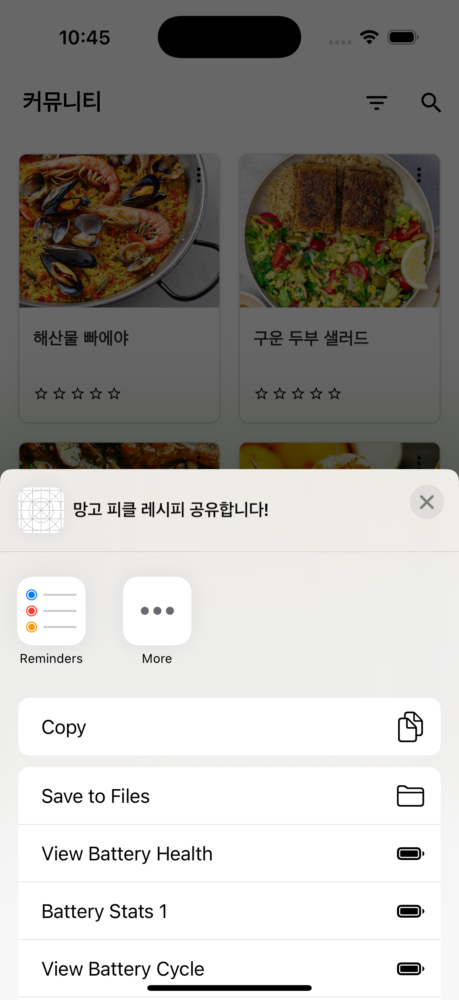  
    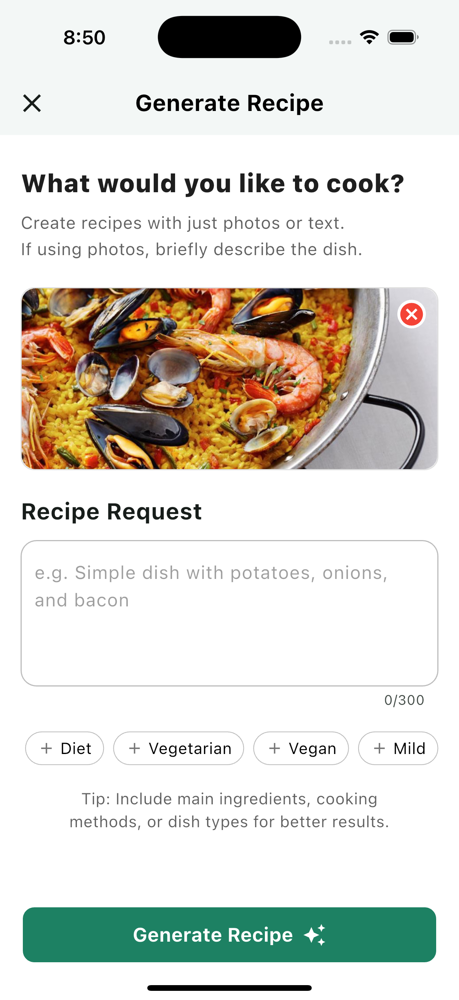  
    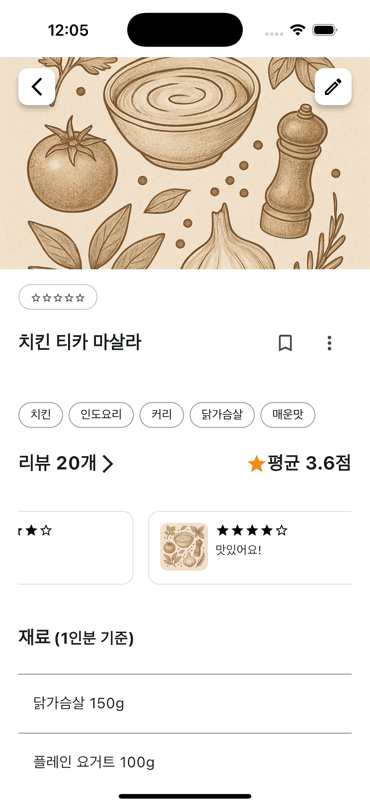  
    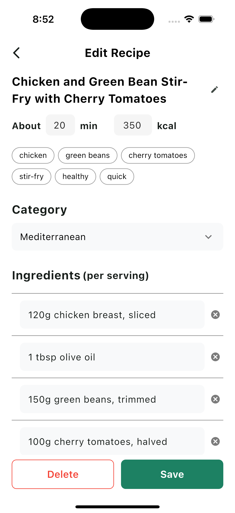  
    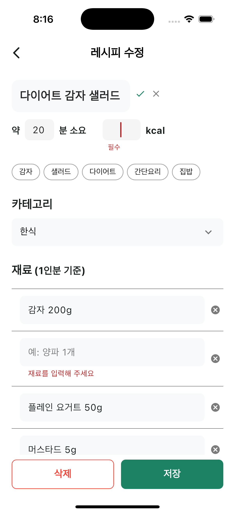  
    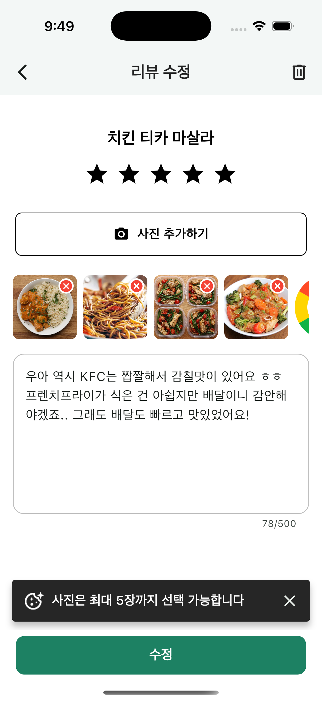  
    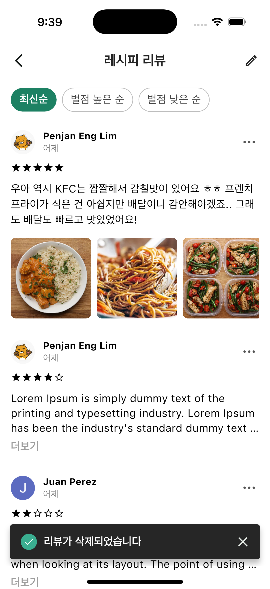  
    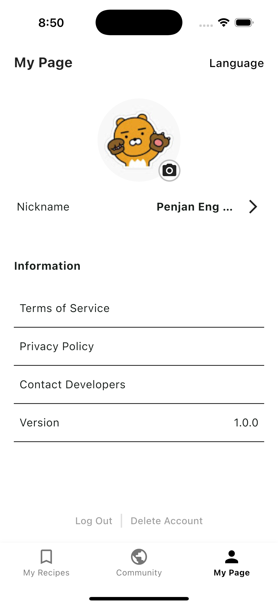  
    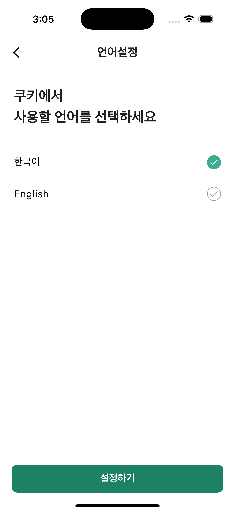  
    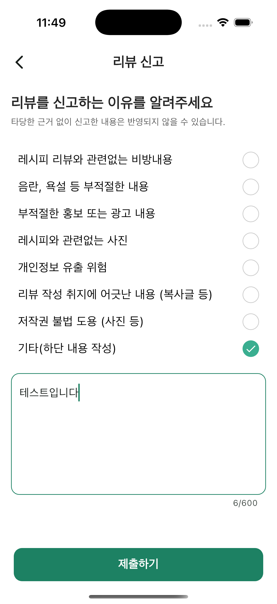  
  </div>  
</div>

## 🎯 주요 기능

### 🔐 사용자 인증

- **소셜 로그인**: Apple, Google, Kakao 로그인 지원
- **Firebase Authentication** 기반 안전한 사용자 관리
- **프로필 관리**: 닉네임 변경, 프로필 이미지 설정

### 🤖 AI 레시피 생성

- **이미지 기반 생성**: 음식 사진을 업로드하여 레시피 자동 생성
- **텍스트 기반 생성**: 재료나 요리명을 입력하여 레시피 생성
- **취향 반영**: 맵기, 아이 친화적 등 UI 칩을 통해 사용자 선호도 반영
- **Gemini AI** 연동으로 정확하고 실용적인 레시피 제공

### 📝 레시피 관리

- **나의 레시피**: 생성한 레시피, 저장한 레시피 분류 관리
- **레시피 편집**: 제목, 재료, 조리과정, 카테고리 수정 가능
- **공개/비공개 설정**: 커뮤니티 공개 여부 선택
- **레시피 공유**: 외부 메신저나 SNS로 레시피 공유

### 👥 커뮤니티 기능

- **레시피 탐색**: 다른 사용자가 공유한 레시피 조회
- **필터링 및 정렬**: 카테고리, 조리시간, 평점별 정렬
- **평점 시스템**: 5점 만점 평점으로 레시피 평가

### ⭐ 리뷰 시스템

- **리뷰 작성**: 텍스트와 사진으로 상세한 리뷰 작성
- **이미지 업로드**: 최대 5장까지 요리 결과물 사진 업로드
- **리뷰 관리**: 리뷰 수정, 삭제, 신고 기능
- **정렬 옵션**: 날짜순, 평점순 리뷰 정렬

### 🌐 다국어 지원

- **한국어/영어** 지원
- **언어 설정**: 앱 내에서 언어 변경 가능
- **자동 감지**: 기기 언어에 따른 초기 언어 설정

## ✨ 추가 기능

### 1. AI 프롬프트 엔지니어링

- **멀티모달 지원**: 이미지와 텍스트 동시 분석
- **Few-shot 프롬프트**: 예시 기반 정확한 레시피 생성
- **입력 검증**: 잘못된 입력이나 비음식 이미지 필터링
- **다국어 프롬프트**: 언어별 최적화된 프롬프트 설계

### 2. 이미지 처리 및 최적화

- **이미지 압축**: 업로드 전 자동 이미지 압축
- **캐시 시스템**: `CachedNetworkImage`를 활용한 효율적인 이미지 로딩
- **멀티 이미지 뷰어**: 확대/축소 및 슬라이드 뷰어 지원

### 3. 상태 관리 및 성능

- **Riverpod 패턴**: 효율적인 상태 관리
- **에러 핸들링**: 체계적인 에러 처리 및 사용자 피드백
- **로딩 최적화**: 병렬 처리를 통한 빠른 데이터 로딩

### 4. 사용자 경험 향상

- **인터랙티브 UI**: 드래그 앤 드롭, 스와이프 제스처 지원
- **실시간 검증**: 입력 필드 실시간 유효성 검사
- **확인 다이얼로그**: 중요한 작업 시 사용자 확인 요청

## 📋 프로젝트 구조

```
📦lib
 ┣ 📂app —————–– 색상, 스타일, 앱 전역 상수
 ┃ ┣ 📂constants		
 ┃ ┣ 📂enum
 ┣ 📂core —————— 공통 유틸리티 및 예외, 밸리데이터, 확장 함수 등
 ┃ ┣ 📂exceptions
 ┃ ┣ 📂extensions
 ┃ ┣ 📂ui_validators
 ┃ ┗ 📂utils
 ┣ 📂data —————— Repository & DataSource 계층
 ┃ ┣ 📂data_source
 ┃ ┣ 📂dto
 ┃ ┗ 📂repository
 ┣ 📂domain ————— 도메인 모델
 ┃ ┗ 📂entity
 ┣ 📂gen ——————– 자동 생성된 파일
 ┃ ┗ 📂l10n
 ┣ 📂l10n ——————– 다국어 소스 파일 (국제화)
 ┣ 📂presentation –––– View + ViewModel
 ┃ ┣ 📂pages
 ┃ ┣ 📂widgets
 ┗ 📜main.dart

```

## 📦 의존성 패키지

(Flutter SDK 3.7.2 사용)
### 핵심 기능
- **flutter_riverpod**: 상태 관리 프레임워크
- **firebase_core**: Firebase 핵심 패키지
- **firebase_auth**: Firebase 인증
- **cloud_firestore**: Firestore 데이터베이스
- **firebase_storage**: Firebase 스토리지
- **firebase_ai**: Gemini AI 통합
- **cloud_functions**: Firebase 클라우드 함수

### UI/UX 및 미디어
- **cached_network_image**: 네트워크 이미지 캐싱
- **image_picker**: 이미지 선택 (카메라/갤러리)
- **flutter_image_compress**: 이미지 압축
- **easy_image_viewer**: 이미지 확대/슬라이드 뷰어
- **share_plus**: 콘텐츠 공유 기능
- **url_launcher**: 외부 URL 실행
- **flutter_svg**: SVG 이미지 지원

### 인증 및 소셜 로그인
- **google_sign_in**: Google 로그인
- **kakao_flutter_sdk_user**: Kakao 사용자 로그인
- **sign_in_with_apple**: Apple 로그인

### 데이터 저장 및 다국어
- **shared_preferences**: 로컬 데이터 저장
- **flutter_localizations**: 다국어 지원
- **intl**: 국제화 및 날짜 포맷팅
- **path_provider**: 디바이스 경로 액세스

### 네트워크 및 설정
- **dio**: HTTP 클라이언트
- **flutter_dotenv**: 환경 변수 관리
- **package_info_plus**: 앱 정보 (버전) 조회

### 개발 및 디버깅
- **firebase_crashlytics**: 크래시 분석
- **flutter_native_splash**: 네이티브 스플래시 화면
- **mocktail**: 테스트 목업 라이브러리

## 🔧 환경 변수 설정

프로젝트 루트에 `.env` 파일을 생성하고 다음 키들을 설정하세요:

```bash
# .env 파일에 다음 키들 추가:
KAKAO_SDK_NATIVE_APP_KEY="YOUR-KEY-HERE"
APPLE_REDIRECT_URI="YOUR-URI-HERE"
APPLE_CLIENT_ID="YOUR-ID-HERE"
```

## 🌟 개발팀

### 개발자 소개 및 연락처

| 이름                           | GitHub                                      | 이메일                  |
| ---------------------------- | ------------------------------------------- | -------------------- |
| 유일송                          | [ilsong963](https://github.com/ilsong963)   | yooilsong@gmail.com  |
| 임대한 (Penjan Antonio Eng Lim) | [daehan-lim](https://github.com/daehan-lim) | penjan.eng@gmail.com |
| 이정찬                          | [chandoli21](https://github.com/chandoli21) |                      |

### 역할 분담

**유일송**
- 회원가입 및 로그인 기능
    - firebase auth
    - apple, google, kakao
- 마이 페이지 및 세팅 화면
    - 로그아웃, 
	- 이용약관
- 상세 페이지

**임대한**
- AI 레시피 생성
    - Gemini API 연동 (요청, 프롬프트 작성, 검증, 등)
    - Firestore로 레시피 업로드 (이미지 업로드 등)
- 레시피 수정 페이지 (수정, 삭제)
- 리뷰 기능 (리뷰 페이지, 리뷰 작성 페이지, 수정 기능)
- 레시피 외부 공유 기능 (텍스트 + 이미지)
- 리뷰 신고 기능
- 언어 설정 및 다국어 UI 지원

**이정찬**
- 나의 레시피 페이지 구현
    - 저장한 레시피 / 내 레시피 / 공유된 레시피 탭
- 커뮤니티 페이지
    - 추천/탐색 기반 레시피 리스트
    - 정렬/필터 기능 설계

## 📄 라이센스

이 프로젝트는 MIT 라이센스 하에 제공됩니다. 자세한 내용은 [LICENSE](LICENSE) 파일을 참조하세요.

---

<p align="center"> <strong>🍪 Cooki와 함께 요리의 즐거움을 발견하세요! 🍪</strong> </p>